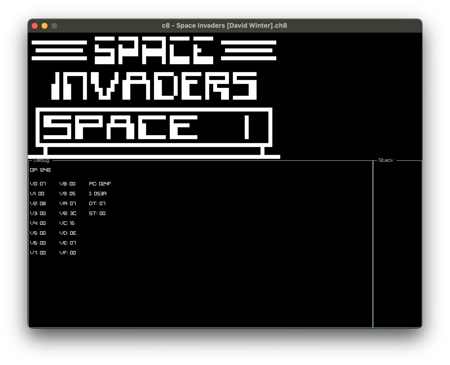

# c8
Another CHIP-8 emulator in C23 using raylib and raygui.



# Build
Should be as simple as that:
```shell
cmake -S . -B build
cmake --build build
```

# Supported platforms
Tested on macOS, Windows and Linux should work as well.
